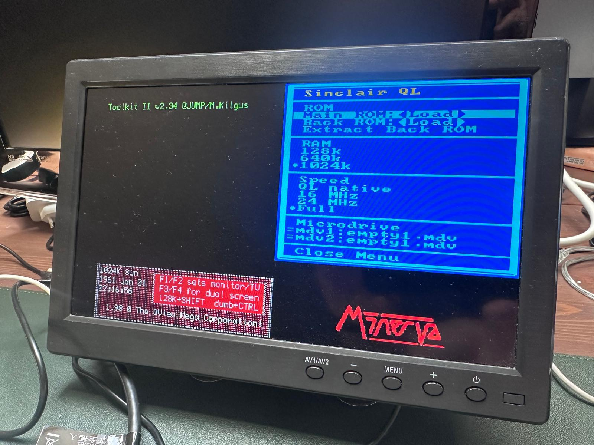
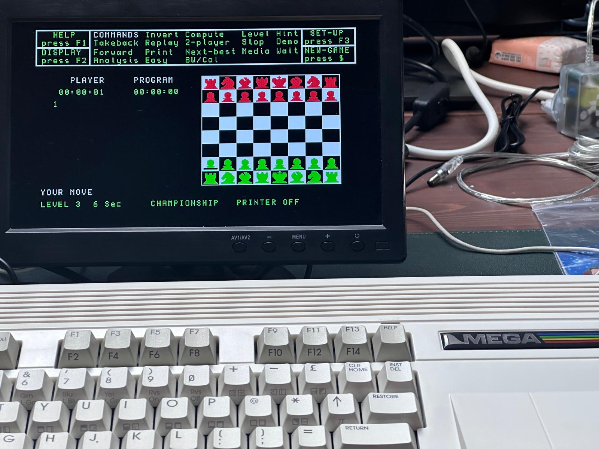
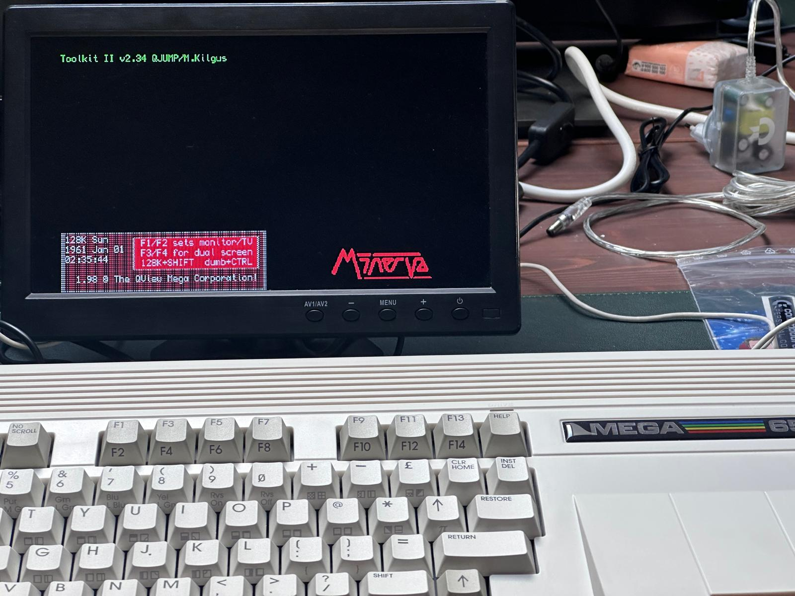
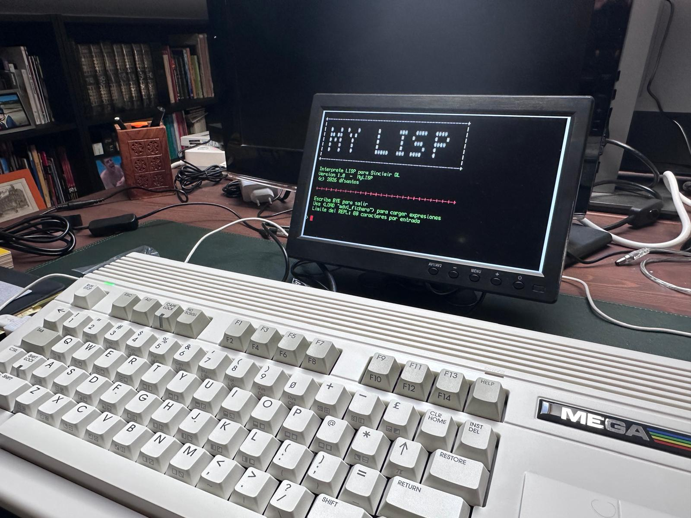
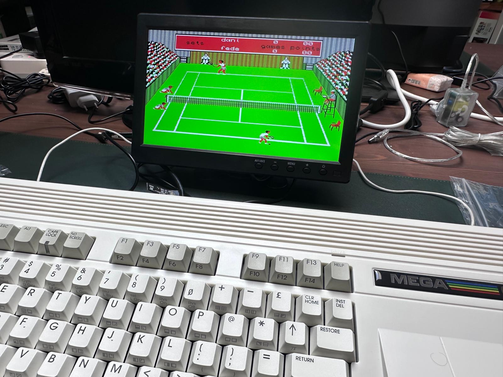

Sinclair QL for MEGA65 (QL4M65)
===============================

A port of the **Sinclair QL** to the **MEGA65**, built on top of the
[MiSTer2MEGA65](https://github.com/sy2002/MiSTer2MEGA65) (M2M) framework and
based on the [MiSTer-devel/QL_MiSTer](https://github.com/MiSTer-devel/QL_MiSTer)
core (68008/`fx68k` CPU, `zx8301` video ULA, `zx8302` I/O ULA).

**Current status: Version 1.01.** The QL boots end-to-end on real MEGA65
R6 hardware: RAM check, boot logo, F1-F4 screen, 10-second timeout (or
F1/F2/F5 response), and into SuperBASIC with a working keyboard - both
Minerva and MGE tested. Selectable RAM size (128k/640k/1024k) and CPU
speed (native/16MHz/24MHz/Full), two independent read/write microdrives
with automatic background SD save, and manual or automatic system ROM
loading are all in place and confirmed working on real hardware, including
real QL software (games, a custom Lisp interpreter) loaded from microdrive,
tested up to Full CPU speed. **V1.01** tunes R3's HyperRAM RWDS sampling
delay to substantially improve microdrive read reliability on the R3
units that were affected - see "Known issues" below for what this does
and doesn't guarantee. See `.research/PORTING-PLAN.md` and `DECISIONES.md`
(in the parent directory) for the full, detailed log of the whole
investigation and every decision made along the way.

Screenshots
-----------

The Options menu's new RAM and Speed radio groups, set to 1024k and Full
(and Minerva confirming "1024K" at boot in the background):

| | |
|---|---|
|  |  |
|  |  |

A chess program; the Minerva boot screen (Toolkit II + QDOS banner);
`MyLISP`, a custom Lisp interpreter for the QL that needs the 640k RAM
option to run, loaded from `mdv1_`; and Match Point (tennis), loaded from
microdrive and played at Full CPU speed - all on real MEGA65 hardware.

Feature overview
-----------------

- **CPU speed**: native QL speed (~7.5 MHz effective) plus 16 MHz, 24 MHz
  and Full (~42 MHz), selectable from the Shell's Options menu - the same
  four speeds the original MiSTer core's own `O78,CPU speed` option
  offers. Memory contention timing (the original QL's video/CPU bus
  sharing) is only modelled at native speed, exactly like the original
  core; the CPU, `zx8302` and both microdrives all scale together, so
  turbo mode speeds up microdrive transfers too, just like it did on real
  1980s turbo-QL expansion boards.
- **RAM**: 128 KB, 640 KB or 1024 KB, selectable from the Shell's Options
  menu - all implemented in FPGA BRAM (not HyperRAM; see the note below on
  why). Changing either the RAM size or the CPU speed triggers a simple,
  automatic core reset so the new setting takes effect immediately, no
  hard reset needed.
- **System ROM**: **Main ROM** (48 KB - Minerva, MGE, JS...) and **Back
  ROM** (16 KB - TK2, Pascal...) as two independent, fixed-size slots. Each
  auto-loads at boot from a fixed SD card path (`/ql4m65/main.rom` /
  `/ql4m65/back.rom`, both optional) and can also be changed at any time
  via the Shell's Options menu ("Main ROM:%s" / "Back ROM:%s" / "Extract
  Back ROM" to clear the Back ROM slot) - the core resets itself
  automatically after any manual change, no hard reset needed.
- **Two independent microdrives** (`mdv1_`, `mdv2_`), each loadable from a
  `.MDV` image via the Shell's Options menu and both fully read/write from
  QDOS/Minerva - `DIR mdv1_`/`LRUN mdv1_xxx` (sustained, continuous reads
  of full-size programs) and `SAVE mdv1_xxx`/reload round-trips both
  tested working on real hardware for both units independently, **and
  those writes are saved back to each drive's own `.mdv` file
  automatically, in the background, with no menu interaction required** -
  each drive's activity LED turns blue whenever there are unsaved changes
  and back to red once they've been written out, so a power cycle no
  longer discards anything. Each drive also has its own synthesized motor
  hum while selected, audible at every CPU speed.
- **Keyboard**: MEGA65 keys mapped to the QL's matrix (replacing the real
  hardware's Intel 8049 IPC microcontroller with a real emulated one
  running the real community-patched firmware, `ipc.vhd`), using a
  deliberately MEGA65-native symbol layout - whatever's silkscreened on a
  MEGA65 key is what it types on the QL, not necessarily what the real
  Sinclair QL keyboard has in that position. Full key-by-key rationale in
  `.research/keyboard-mapping-design.md`.
- PAL video, over **HDMI** - see the VGA note below.

Not yet in scope: QL-SD (`QXL.WIN`), mouse, or GoldCard/SMSQ,E support -
see `.research/PORTING-PLAN.md` section 7 for what's planned next.

### Known issues

- **VGA output doesn't currently work** (including the on-screen menu) -
  use **HDMI**, which works correctly. Not yet investigated; if you can
  help narrow this down, please open an issue.
- **A microdrive stability issue has been detected on some MEGA65 R3
  boards with higher-latency HyperRAM chips** - occasional `lrun`/`DIR`
  failures ("bad or changed medium"), not a logic bug but a real
  board-to-board timing margin difference in the physical HyperRAM chip.
  V1.01 tunes R3's HyperRAM sampling delay specifically for this and fixes
  it on most affected boards tested so far; a small number of R3 units may
  still be affected. If `lrun`/`DIR` ever hangs or errors on real R3
  hardware, please open an issue - more real-hardware reports help narrow
  this down further. Full investigation in `DECISIONES.md` (parent
  directory).

### Why RAM is in BRAM, not HyperRAM

An earlier build put the main, CPU-addressed RAM on the MEGA65's HyperRAM
chip instead of FPGA BRAM, reasoning that HyperRAM would be needed anyway
for the largest RAM size. It compiled clean and passed timing, but hung on
real hardware during microdrive `LOAD`/`SAVE`. Investigating how two other
M2M cores on this same MEGA65 hardware handle their own main RAM (AExp, an
unreleased Amiga port, keeps its Chip+Slow RAM entirely in BRAM;
[C64MEGA65](https://github.com/MJoergen/C64MEGA65)'s HyperRAM-backed REU is
only ever accessed by its own DMA controller, never by the 6502 directly) -
and the M2M framework's own
documentation - confirmed that a CPU's directly-addressed main memory
doesn't belong on HyperRAM in this framework: HyperRAM works well for
DMA-style, latency-tolerant traffic (like the two microdrives above), not
for a bus a CPU blocks on every cycle. RAM went back to BRAM, sized for
the largest selectable tier (1024 KB - measured against this FPGA's real
BRAM budget, not guessed; 2048 KB/4096 KB genuinely don't fit). Full
diagnosis, including the exact real-hardware symptom that gave it away, in
`DECISIONES.md`'s "Milestone 3" sections.

### Microdrive image format: it must be a genuinely valid QLAY `.mdv`

QDOS/Minerva validates every microdrive sector against a real checksum as it
reads it - just like it would on real hardware. This port's `mdv.v` emulates
the microdrive at the same low, bit-serial level real hardware used, so it's
just as strict as the real thing: **if a `.MDV` image's checksums don't
match its data, QDOS will refuse to read it**, exactly as a real QL would
reject a damaged cartridge. This bit us hard during development - several
downloaded/re-authored test images turned out to have corrupted sector or
block-header checksums (usually because whatever tool wrote a file onto a
blank image never recalculated the checksum for the header it overwrote),
which looked for a long time like a hardware/timing bug because higher-level
emulators (that model the microdrive as a filesystem, or intercept QDOS's
own calls, rather than emulating the real bit-serial protocol) never
noticed the corruption and loaded the same files without complaint.

If a `.MDV` doesn't load - `DIR` never finishing, or a `LRUN`'d program
hanging partway through - **check the image before suspecting the core**:
`Fase0/tools/mdvcheck.py` (not in this repository) validates every sector's
checksums against the real Minerva algorithm and reports exactly where a
`.mdv` is broken; `mdvrepair.py` can fix checksum-only corruption without
touching any data. See `DECISIONES.md`'s microdrive sections for the full
story.

Getting the compiled core
--------------------------

This repository is source only - no compiled QL4M65 `.cor` file is
committed here. (The only `.cor` files tracked in this repo are unrelated
QNICE-FPGA demo bitstreams bundled with the M2M framework's own
`M2M/QNICE/dist_kit/`, not the QL4M65 core itself.)
Ready-to-use `.cor` files for MEGA65 **R6** (tested on real hardware) and
**R3** (compiles clean, not yet tested on real R3 hardware - see the
release notes), together with a Minerva system ROM, are published on
the [GitHub Releases page](https://github.com/dfernande132/QL4M65/releases)
- see the instructions file bundled with each release for exactly where
each file goes on the SD card. Minerva and TK2 are GPL/GNU-licensed and can
be redistributed, which is why they're included; other QL ROMs (MGE, JS,
...) are not, since their licensing is unclear or restrictive - for those,
see the [Sinclair QL ROM archive](https://sinclairql.net/djw/qlrom/index.html),
which has the full set. The
[MEGA65 community on Discord](https://discord.com/channels/719326990221574164/1177364456896999485)
is also a good place to ask if you're missing something. Building the core
yourself from source requires your own copy of a QL system ROM placed on
the SD card (see the feature overview above).

Repository layout
------------------

- `CORE/vhdl/` - the actual QL4M65 port (clock generation, memory map, video/
  keyboard wiring, Shell configuration)
- `CORE/QL_MiSTer/` - git submodule, the MiSTer QL core (mostly unmodified;
  see `doc/m2m/exceptions.md` for the handful of deliberate changes and why)
- `M2M/` - the MiSTer2MEGA65 framework itself (one deliberate, documented
  exception - a small hook in `shell.asm` needed for mdv1's background SD
  write-back, since it's not a vdrive; see `doc/m2m/exceptions.md`)
- `.research/PORTING-PLAN.md` - the porting dossier and hardware-test log
  (every tested build, what changed, what happened)
- `DECISIONES.md` (parent directory) - chronological log of every technical
  decision and diagnosis made during this port, in Spanish

Credits
-------

- QL4M65 port by Jose Daniel Fernandez Santos ([dfsantos](https://github.com/dfernande132))
- MiSTer2MEGA65 framework by sy2002 and MJoergen
- MiSTer-devel/QL_MiSTer core by the MiSTer QL community

Licensed under GPL v3.

---

Built on the [MiSTer2MEGA65](https://github.com/sy2002/MiSTer2MEGA65)
framework - learn more about M2M itself via
[The Ultimate MiSTer2MEGA65 Porting Guide](https://github.com/sy2002/MiSTer2MEGA65/wiki/The-Ultimate-MiSTer2MEGA65-Porting-Guide)
or the [friendly MEGA65 community on Discord](https://discord.com/channels/719326990221574164/1177364456896999485).
